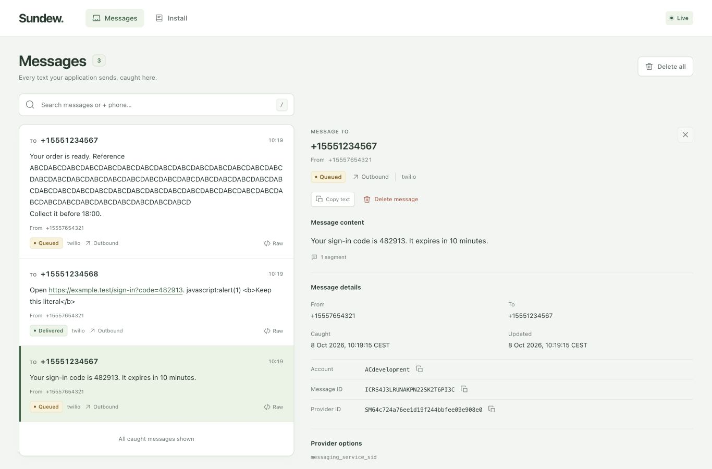

# Sundew

**A catch-all SMS service for development and end-to-end tests — Mailpit, for text messages.**

Sundew stands in for the SMS providers your application talks to (Twilio, Vonage, MessageBird,
Plivo, …). Point the application's provider base URL at Sundew and every message it "sends" is
caught, stored and shown in a small web UI, and available to your E2E tests over a plain HTTP API.
Nothing ever reaches a phone.

## Why the name

The sundew (*Drosera*) is a small carnivorous plant whose leaves carry glistening sticky droplets.
Anything small that lands on them is held fast and kept, in plain view, for the plant to take its
time with. Sundew the service does the same with short messages: whatever your application sends
lands on it, sticks, and stays visible until you have looked. Small prey, small messages; a drop of
dew per text.

## Status

Twilio send/fetch, the query API, callback simulation and the live web inbox are implemented.
Messages are kept in memory for the life of the process. See the
[brief](docs/journal/2026-10-08/draft-sundew-brief.md).

## Run it

Run a published version from Docker Hub (replace `<version>` with a release version):

```sh
docker run --rm -p 8025:8025 kobylinski/sundew:<version>
curl http://localhost:8025/healthz
```

For an application using Compose:

```yaml
services:
  sundew:
    image: kobylinski/sundew:<version>
    ports:
      - "8025:8025"
  app:
    image: <your-application-image>
    environment:
      TWILIO_API_BASE: http://sundew:8025
```

Set your application's Twilio client base URL from `TWILIO_API_BASE`; Sundew needs
no real provider credentials. The same network serves the façades, query API and UI.
See [releasing](docs/releasing.md) for image setup and version tags. To build from
this checkout instead, run `docker build -t sundew:dev .`.

The health endpoint returns `ok`. Stop with Ctrl-C; SIGTERM drains HTTP requests before exit.
The runtime image contains one static Go binary and CA certificates; it needs no Node runtime.

Messages live in memory and disappear when the process stops. No database or volume is needed.

Configuration is read once at startup. Empty variables use the defaults below; malformed
values stop startup with the variable name in the error.

| Variable | Default | Meaning |
| --- | --- | --- |
| `SUNDEW_ADDR` | `:8025` | HTTP listen address |
| `SUNDEW_CALLBACK_DELAY` | `0s` | Nonnegative Go duration between callbacks |
| `SUNDEW_CALLBACK_OUTCOME` | `delivered` | `delivered` or `failed` |
| `SUNDEW_BASE_URL` | empty | Absolute HTTP(S) base URL for provider response links |
| `SUNDEW_INBOUND_URL` | empty | Absolute HTTP(S) default inbound webhook target |

## Development checks

Run Go locally, and Docker acceptance against the selected local or remote engine:

```sh
go vet ./...
go test -race ./...
scripts/acceptance.sh
```

The acceptance runner builds a unique image, runs executable `scripts/acceptance/*.sh` steps
in name order and cleans up its containers, network, volumes and image on success or failure.
Clients run on the same Docker network as Sundew. No host ports or bind mounts are needed;
`DOCKER_HOST` and Docker contexts work for remote engines too. The health step measures
startup under one second; the runner requires an image smaller than 30 MB.

## API for tests

The stable JSON API lives at `/api/v1`. Read the newest SMS to a number:

```sh
curl 'http://localhost:8025/api/v1/messages/latest?to=%2B15551234567'
```

`GET /api/v1/messages` returns `{"items":[…],"next_cursor":"…"}`, newest first.
`q` searches to/from/body/account with a case-insensitive substring. Filters combine
with AND. Filters `to`, `from`, `account` and `provider` match exactly; `body` is a
case-insensitive substring; `since` is an inclusive RFC 3339 bound on `created_at`.
Use `limit` (1–500, default 50) and the returned `next_cursor` as `cursor` for the
next page. URL-encode phone numbers so `+` becomes `%2B`. Read a message by its
Sundew ID with `GET /api/v1/messages/{id}`. Latest and get return 404 when absent.

Connect to `GET /api/v1/messages/stream` before sending to wait without sleeps.
It streams SSE events named `message.created`, `message.updated`, `message.deleted`
and `store.reset`; each `data:` is a JSON event containing its message (except reset).
The same filters apply, and reset always reaches every subscriber. A comment
heartbeat arrives every 15 seconds. The stream has no replay; reconnect and query
the store after a disconnect. Connected subscribers receive events in publication order.

Use `POST /api/v1/reset` in test setup, `DELETE /api/v1/messages` to delete all,
or `DELETE /api/v1/messages/{id}` to delete one. Success returns 204. Reset and
delete cancel pending status callbacks for the affected messages.

To simulate an application's inbound SMS webhook:

```sh
curl -X POST http://localhost:8025/api/v1/inbound \
  -H 'Content-Type: application/json' \
  -d '{"from":"+15551234567","to":"+15557654321","body":"STOP","url":"http://app:8000/sms/inbound"}'
```

`provider` defaults to `twilio`; `account` and `media_urls` are optional. `url`
overrides `SUNDEW_INBOUND_URL`; one must be configured. A successful delivery
returns 201 with `{"message":{…},"response_status":204}` (the status is the
application's actual response). An HTTP rejection is recorded and returned too;
a connection failure or timeout returns 500. Delivery times out after five seconds
and does not follow redirects. The generated OpenAPI 3.1 document is served at
`GET /api/v1/openapi.json`; errors use `{"error":{"code":"…","message":"…"}}`.

For outbound messages carrying a provider status-callback URL, Sundew sends
`queued`, `sent`, then `delivered`, waiting `SUNDEW_CALLBACK_DELAY` between sends.
Set `SUNDEW_CALLBACK_OUTCOME=failed` for a final failed webhook with the provider's
default error code. A failed receiver is logged and the sequence continues.

## Web UI

Open `http://localhost:8025/` for the live inbox, substring search and exact To/From phone
filters. Select a message for its continuous report and original HTTP exchange; Raw jumps
to the captured request. Delete confirmations distinguish one message from the entire store.
Install help is one navigation link away. The layout adapts to phones and follows the system
light/dark preference. Links open a new tab; captured raw exchanges remain literal.



The image builds and embeds the Svelte application. For a local Go binary with the UI:

```sh
cd web
npm ci
npm test
npm run build
cd ..
go run ./cmd/sundew
```

A fresh clone can build and test Go without Node; it serves a small “UI is not built” page.
Generated assets are ignored and replaced by each web build; only the Go fallback page is
committed. `npm run dev` in `web/` starts Vite at `http://127.0.0.1:4281` and proxies the API
to a local Sundew process at port 8025. No Node server runs in the released image.
